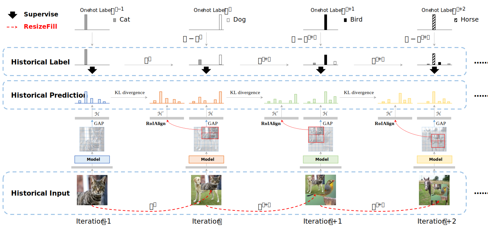

# Code for 'RecursiveMix: Mixed Training with History'

<p align="center"> </p>
 
RecursiveMix (RM), which uses the historical input-prediction-label triplet to enhance the generalization of Deep Vision Models. [Paper](https://arxiv.org/pdf/2203.06844.pdf)

## Requirements

Experiment Environment
- python 3.6
- pytorch 1.7.1+cu101
- torchvision 0.8.2
- mmcv-full 1.4.1
- mmdet 2.19.1
- mmsegmentation 0.20.2

## Usage

### 1. Train the model
For example, to reproduce the results of RM in CIFAR-10 (97.65% Top-1 acc in averaged 3 runs, logs are provided in logs/):
```python
CUDA_VISIBLE_DEVICES=0,1 python -m torch.distributed.launch --nproc_per_node=2 --master_port 29500 main.py \
            --name 'your_experiment_log_path' \
            --model_file 'pyramidnet' \
            --model_name 'pyramidnet_200_240' \
            --data 'cifar10' \
            --data_dir '/path/to/CIFAR10' \
            --epoch 300 \
            --batch_size 64 \
            --lr 0.25 \
            --scheduler 'step' \
            --schedule 150 225 \
            --weight_decay 1e-4 \
            --nesterov \
            --num_workers 8 \
            --save_model \
            --aug 'recursive_mix' \
            --aug_alpha 0.5 \
            --aug_omega 0.1
```

RM in ImageNet (79.20% Top-1 acc)
```python
CUDA_VISIBLE_DEVICES=0,1,2,3,4,5,6,7 python -m torch.distributed.launch --nproc_per_node=8 --master_port 29500 main.py \
            --name 'your_experiment_log_path' \
            --model_file 'resnet' \
            --model_name 'resnet50' \
            --data 'imagenet' \
            --epoch 300 \
            --batch_size 512 \
            --lr 0.2 \
            --warmup 5 \
            --weight_decay 1e-4 \
            --aug_plus \
            --num_workers 32 \
            --save_model \
            --aug 'recursive_mix' \
            --aug_alpha 0.5 \
            --aug_omega 0.5
```


### 2. Test the model
```python
CUDA_VISIBLE_DEVICES=0,1 python -m torch.distributed.launch --nproc_per_node=2 --master_port 29500 main.py \
            --name 'your_experiment_log_path' \
            --batch_size 64 \
            --model_file 'pyramidnet' \
            --model_name 'pyramidnet_200_240' \
            --data 'cifar10' \
            --data_dir '/path/to/CIFAR10' \
            --num_workers 8 \
            --evaluate \
            --resume 'best'
```

## Model Zoo
### Image Classification
- ImageNet-1K (300 epoch)

| Backbone       | Size  | Params (M) |   Acc@1   |                             Log                             |                                                           Download                                                            |
| -------------- | :---: | :--------: | :-------: | :---------------------------------------------------------: | :---------------------------------------------------------------------------------------------------------------------------: |
| ResNet-50      |  224  |   25.56    |   76.32   |                             log                             |                                                             model                                                             |
| + Mixup        |  224  |   25.56    |   77.42   |                             log                             |                                                             model                                                             |
| + CutMix       |  224  |   25.56    |   78.60   |                             log                             |                                                             model                                                             |
| + RecursiveMix |  224  |   25.56    | **79.20** | [log](logs/log_imagenet_300epoch_r50_rm_79.20_top1_acc.log) | [model](https://github.com/implus/RecursiveMix/releases/download/v0.0/checkpoint_imagenet_300epoch_r50_rm_79.20_top1_acc.pth) |

### Object Detection

- COCO (1x schedule)

#### ATSS

| Backbone       | Lr schd | Mem (GB) | Inf time (fps) |  box AP  |                                                              Log                                                               |                                                            Download                                                            |
| -------------- | :-----: | :------: | :------------: | :------: | :----------------------------------------------------------------------------------------------------------------------------: | :----------------------------------------------------------------------------------------------------------------------------: |
| ResNet-50      |   1x    |   3.7    |      19.7      |   39.4   | [log](https://download.openmmlab.com/mmdetection/v2.0/atss/atss_r50_fpn_1x_coco/atss_r50_fpn_1x_coco_20200209_102539.log.json) | [model](https://download.openmmlab.com/mmdetection/v2.0/atss/atss_r50_fpn_1x_coco/atss_r50_fpn_1x_coco_20200209-985f7bd0.pth)  |
| + CutMix       |   1x    |   3.7    |      19.7      |   40.1   |                                 [log](logs/log_coco_12epoch_atss_r50_fpn_cutmix_40.1_ap.json)                                  | [model](https://github.com/implus/RecursiveMix/releases/download/v0.0/checkpoint_coco_12epoch_atss_r50_fpn_cutmix_40.1_ap.pth) |
| + RecursiveMix |   1x    |   3.7    |      19.7      | **41.5** |                                   [log](logs/log_coco_12epoch_atss_r50_fpn_rm_41.5_ap.json)                                    |   [model](https://github.com/implus/RecursiveMix/releases/download/v0.0/checkpoint_coco_12epoch_atss_r50_fpn_rm_41.5_ap.pth)   |

### Semantic Segmentation

- ADE20K (80k iteration)

#### UPerNet
| Backbone       | Crop Size | Lr schd | Mem (GB) | Inf time (fps) |   mIoU    |                               Log                               |                                                             download                                                             |
| -------------- | :-------: | :-----: | :------: | :------------: | :-------: | :-------------------------------------------------------------: | :------------------------------------------------------------------------------------------------------------------------------: |
| ResNet-50      |  512x512  |  80000  |   8.1    |     23.40      |   40.40   | [log](logs/log_ade20k_80k_upernet_r50_baseline_40.40_miou.json) | [model](https://github.com/implus/RecursiveMix/releases/download/v0.0/checkpoint_ade20k_80k_upernet_r50_baseline_40.40_miou.pth) |
| + CutMix       |  512x512  |  80000  |   8.1    |     23.40      |   41.24   |  [log](logs/log_ade20k_80k_upernet_r50_cutmix_41.24_miou.json)  |  [model](https://github.com/implus/RecursiveMix/releases/download/v0.0/checkpoint_ade20k_80k_upernet_r50_cutmix_41.24_miou.pth)  |
| + RecursiveMix |  512x512  |  80000  |   8.1    |     23.40      | **42.30** |    [log](logs/log_ade20k_80k_upernet_r50_rm_42.30_miou.json)    |    [model](https://github.com/implus/RecursiveMix/releases/download/v0.0/checkpoint_ade20k_80k_upernet_r50_rm_42.30_miou.pth)    |
